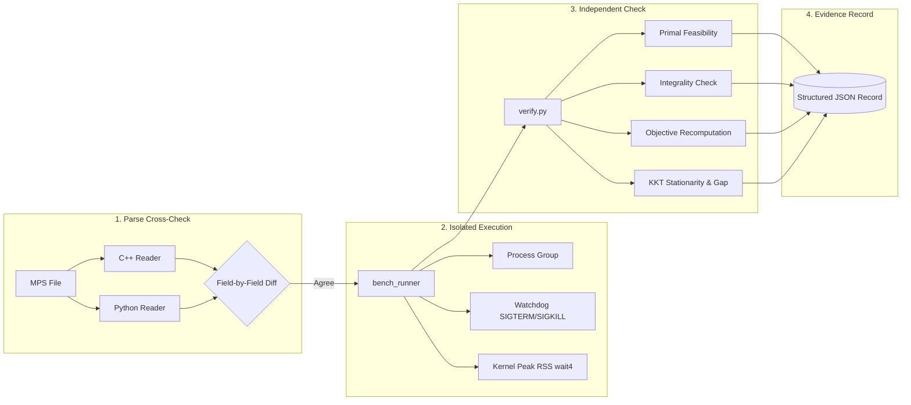

# Optimisation Solver

[](https://en.wikipedia.org/wiki/C%2B%2B17)
[](https://cmake.org/)
[](tests/)
[](LICENSE)
[](benchmarks/)

**An indigenous, modular mathematical optimization solver written in modern C++17 for linear programming (LP), mixed-integer linear programming (MILP), and convex quadratic programming (QP), with an additional engine for smooth nonlinear programs (NLP).**

---

### Smart India Hackathon (SIH 2026)

- **Organization:** Mangalore Refinery and Petrochemicals Limited (MRPL)
- **Problem Statement ID:** SIH26119
- **Problem Title:** Indigenous GPU-Accelerated Optimization Solver (Sovereign Alternative to Express / CPLEX)
- **Category:** Software
- **Theme:** Smart Automation

---

## Overview

Mathematical optimization is foundational across refinery operations, supply chain scheduling, pipeline dispatch, and industrial resource allocation. Commercial enterprise solvers (such as FICO Xpress and IBM CPLEX) are proprietary, closed-source, and subject to costly licensing fees and external software dependencies.

`optimisation_solver` provides an open-source, modular optimization engine built around sound numerical algorithms and clean software architecture. Rather than tightly coupling file parsing, presolve reductions, and numerical execution into a monolithic codebase, this project separates each stage into distinct modules with mathematically verified contracts:

> **Value Proposition:** A modular C++17 optimization solver with LP, MILP, and QP support, invertible presolve/postsolve coordinate reconstruction, multiple numerical engines, and an independent benchmark verification pipeline.

---

## Verified at a Glance

| Metric | Verified Value | Evidence & Scope |
| :--- | :---: | :--- |
| **Automated Test Targets** | **64 / 64** | All registered CTest targets pass in a Release build. Test targets compile with `-UNDEBUG`, so `assert()` stays active even in Release. |
| **Netlib LP Smoke Suite (8 small instances)** | **8 / 8** | Every instance is independently verified optimal (`optimal_verified`) by at least one internal engine: Dual Simplex 6/8 and PDLP 6/8 individually, with 4 instances verified by both. The native HiGHS reference verifies 8/8. |
| **Hand-Crafted Reference Suite (11 instances)** | **11 / 11 parse agreement** | Both readers agree on all 11. Of the solver runs, 7 are `optimal_verified` (LP and 2 QP), 1 is `feasible` (MILP knapsack; no dual-bound certificate), and 3 are `not_applicable`: an infeasible LP and an unbounded LP, whose claims are not certified, and an MIQP that the solver refuses as unsupported. |
| **Parser Cross-Check** | **19 / 19** | The C++ reader (`--dump-model`) and an independently written Python reader agree field-by-field on all 19 instances in the committed results (8 Netlib + 11 hand-crafted). |

---

## Benchmark Evidence

The repository incorporates a reproducible, process-isolated benchmark harness (`benchmarks/bench.py`) that executes instances under strict OS-level watchdogs and verifies solutions against an **independent external checker** (`benchmarks/lib/verify.py`). Solutions are never evaluated based on the solver's self-reported status; all row activities, bound violations, and duality gaps are recomputed directly from the unscaled, original model.

### Netlib LP Smoke Benchmark

This is a **smoke suite of 8 small Netlib LP instances**, not the full Netlib collection, and not a general performance claim. Each solver runs as its own process under `bench_runner` with a **30-second timeout** and **one thread** (`--threads 1`).

- **Full per-run records:** [`benchmarks/results/netlib_lp.json`](benchmarks/results/netlib_lp.json)
- **Flat table:** [`netlib_lp_benchmark.csv`](benchmarks/results/netlib_lp_benchmark.csv)
- **Readable summary:** [`NETLIB_RESULTS.md`](benchmarks/results/NETLIB_RESULTS.md)

**HiGHS reference methodology.** HiGHS is measured with its **native `highs` executable** (HiGHS 1.15.1), not through Python/SciPy:

- It runs the simplex solver with `parallel=off` and one thread.
- `bench_runner` launches and measures the `highs` process on its own.
- The solution file is parsed after the run, outside the measured process.
- HiGHS is a reference only. Nothing in the solver links to it or includes it.

Cells show the independent checker's verdict and the whole-process wall-clock time.

| Instance | Rows × Cols | Dual Simplex (`dual_simplex`) | PDLP (`pdlp`) | HiGHS native (`highs-ds`) |
| :--- | :---: | :--- | :--- | :--- |
| `adlittle` | 56 × 97 | **Optimal verified** (0.010 s) | Feasible; objective matches published value, optimality not proven (0.015 s) | **Optimal verified** (0.019 s) |
| `afiro` | 27 × 32 | **Optimal verified** (0.003 s) | **Optimal verified** (0.003 s) | **Optimal verified** (0.004 s) |
| `blend` | 74 × 83 | Feasible; stopped at a limit, objective short of published value (0.016 s) | **Optimal verified** (0.017 s) | **Optimal verified** (0.005 s) |
| `degen2` | 444 × 534 | **Optimal verified** (1.503 s) | **Optimal verified** (0.496 s) | **Optimal verified** (0.022 s) |
| `recipe` | 91 × 180 | **Optimal verified** (0.028 s) | **Optimal verified** (0.026 s) | **Optimal verified** (0.005 s) |
| `sc50a` | 50 × 48 | **Optimal verified** (0.004 s) | **Optimal verified** (0.005 s) | **Optimal verified** (0.004 s) |
| `sc50b` | 50 × 48 | **Optimal verified** (0.004 s) | Feasible; objective matches published value, optimality not proven (0.005 s) | **Optimal verified** (0.005 s) |
| `share2b` | 96 × 79 | Feasible; stopped at a limit, objective short of published value (0.106 s) | **Optimal verified** (0.156 s) | **Optimal verified** (0.006 s) |

| Solver | Verified optimal | Feasible point returned | Objective matches published value |
| :--- | :---: | :---: | :---: |
| `optimsolver:dual_simplex` | 6 / 8 | 8 / 8 | 6 / 8 |
| `optimsolver:pdlp` | 6 / 8 | 8 / 8 | 8 / 8 |
| `highs:highs-ds` (native reference) | 8 / 8 | 8 / 8 | 8 / 8 |

#### Observations

1. **Dual Simplex** independently verifies **6 / 8** instances. On `blend` and `share2b` it stops with status `limit_reached` and returns no duals. The feasible points it returns there are well short of the published optimum: about 0 vs −30.812 on `blend`, and −374.52 vs −415.73 on `share2b`.
2. **PDLP** independently verifies **6 / 8** instances. On `adlittle` and `sc50b`, PDLP itself reports `optimal`, and its point is feasible with an objective that agrees with the published value. The independent checker could not close an optimality proof, though. On `adlittle` the returned duals do not satisfy the KKT/gap check within tolerance, and on `sc50b` no duals were returned. Both are therefore recorded as `feasible`, not as verified optimal.
3. **Together**, the two internal engines independently verify all **8 / 8** instances of this smoke suite. Each engine covers the instances the other did not verify, and 4 instances (`afiro`, `degen2`, `recipe`, `sc50a`) are verified by both. This is the union of separate runs, each with one requested engine; a single `optimsolver solve` call uses one engine.
4. **HiGHS** verifies 8 / 8 and was faster on average (see below). On the largest instance, `degen2`, it took 0.022 s against 0.496 s for PDLP and 1.503 s for Dual Simplex.

### QP Verification

The hand-crafted benchmark suite (`benchmarks/instances/known/`) includes convex quadratic minimization (`convex_qp.mps`) and concave quadratic maximization (`max_qp.mps`) formulations. Both instances are solved by the ADMM engine (`qp_engine`) and receive `optimal_verified` from the independent checker (`benchmarks/results/known.json`). The checker recomputes stationarity, complementary slackness and the duality gap from the original model and finds all three within tolerance. These are small hand-constructed fixtures with known analytical optima, not a claim of broad external QP benchmark coverage.

---

## Measured Performance & Memory

Wall time and peak resident set size (RSS) are measured by the POSIX `bench_runner` harness. It uses a monotonic clock (`std::chrono::steady_clock`) and reads kernel process usage from `wait4(..., ru_maxrss)`. The figures below are averaged over the 8 smoke-suite instances in `benchmarks/results/netlib_lp.json` (MB = 10⁶ bytes):

| Configuration | Mean Wall Time | Mean Peak RSS | Peak RSS Range |
| :--- | :---: | :---: | :---: |
| `optimsolver:pdlp` | 0.090 s | 2.02 MB | 1.65 MB – 3.65 MB |
| `optimsolver:dual_simplex` | 0.209 s | 2.84 MB | 1.64 MB – 9.52 MB |
| HiGHS native reference (`highs-ds`) | 0.009 s | 4.17 MB | 3.78 MB – 5.34 MB |

> *How to read this:*
> - *These figures come from 8 small instances on one machine. They are workload-specific and are not a general performance claim.*
> - *HiGHS was faster on average. On the smallest instances all three are within a few milliseconds of each other, and process start-up dominates.*
> - *Mean peak RSS was lower for both internal engines on this suite, but not on every instance: Dual Simplex peaked at 9.52 MB on `degen2` against 5.34 MB for HiGHS.*
> - *`NETLIB_RESULTS.md` reports the per-solver maximum in MiB (3.5 / 9.1 / 5.1).*
> - *Earlier revisions of this README compared against HiGHS hosted inside a Python/SciPy process (≈ 72 MB, 0.34 s). Those figures mostly measured the interpreter and are superseded.*

---

## Independent Verification Pipeline

A solver that checks its own output cannot provide reliable benchmark evidence. All benchmark instances run through a four-stage isolated verification pipeline:



### Frozen Verification Tolerances

Tolerances are frozen across all benchmark runs to guarantee fair comparisons:

| Check | Absolute Tolerance | Relative / Normalized Formula |
| :--- | :---: | :--- |
| **Row Feasibility** | `1e-6` | $\text{tol}_i = 10^{-6} + 10^{-8} \cdot \max(1, \|l_i\|, \|u_i\|, \sum_j \|a_{ij} x_j\|)$ |
| **Bound Feasibility** | `1e-6` | $\text{tol}_j = 10^{-6} + 10^{-8} \cdot \max(1, \|lb_j\|, \|ub_j\|, \|x_j\|)$ |
| **Integrality** | `1e-6` | $\|x_j - \text{round}(x_j)\| \le 10^{-6}$ (strict absolute) |
| **Optimality Gap** | `1e-6` | $\text{gap}_{\text{norm}} = \frac{\|p - d\|}{1 + \|p\| + \|d\|} \le 10^{-6}$ (minimization form) |

### Strict Status vs. Verdict Separation

The pipeline enforces an explicit separation between what the solver claims and what the checker proves:
- **Solver Termination Status:** `optimal`, `infeasible`, `unbounded`, `limit_reached`, `numerical_failure`.
- **Independent Checker Verdict:** `optimal_verified` (primal feasible and gap closed), `feasible` (primal feasible without dual proof), `infeasible_point` (model violated), `nonfinite` (contains NaN/Inf), `no_point` (timeout or crash), `not_applicable` (infeasibility/unboundedness claims, which are not independently certified, and models the solver refuses as unsupported).

---

## Architecture & Numerical Engines

```text
       MPS File (.mps)
              ↓
       Model IR (Linear, Quadratic, Bounds, Types)
              ↓
       Structural Validation (bounds, row indices)
              ↓
       Classification (LP / QP / MILP)
              ↓
       Presolve (Once) ───────── logs PresolveResult ─────────┐
              ↓                                               │
       Reduced Model                                          │
              ↓                                               │
       Solver Dispatch                                        │
       ├── PDLP (First-Order LP)                              │
       ├── Dual Simplex (Tableau LP)                          │
       ├── Branch-and-Cut (MILP)                              │
       └── ADMM QP (Quadratic Programming)                    │
              ↓                                               │
       Reduced SolveResult                                    │
              ↓                                               │
       Postsolve (Once) <─────────────────────────────────────┘
              ↓
       Original-Space Solution (Primal & Dual Reconstructed)
```

### The Single-Presolve Invariant

Presolve reductions (fixed variable elimination, singleton row removals, bound tightening with provenance tracking, and redundant constraint purging) execute **exactly once** on the original formulation. Coordinate transformations are logged in an audit record (`PresolveResult`). Postsolve consumes this audit record to reconstruct original coordinates and map shadow prices back to original constraints. Redundant presolving is strictly forbidden to prevent coordinate drift.

### Core Solver Engines

1. **PDLP Engine (`pdlp_engine/`):** Implements Primal-Dual Hybrid Gradient (PDHG) with Ruiz diagonal equilibration, the PDLP adaptive linesearch for step sizes, and normalized duality gap restarts.
2. **Dual Simplex Solver (`milp_engine/`):** Tableau-based simplex algorithm delivering exact basic feasible solutions; serves as the root and node relaxation solver for integer programs.
3. **Branch-and-Cut Engine (`milp_engine/`):** Tree search with dynamic Gomory fractional cut generation, most-fractional branching, and primal rounding heuristics for Mixed-Integer Linear Programs (MILP).
4. **Convex QP Engine (`qp_engine/`):** Alternating Direction Method of Multipliers (ADMM) with augmented KKT system factorizations for convex quadratic objectives ($f(x) = \frac{1}{2} x^T P x + q^T x + \text{offset}$).
5. **Smooth NLP Engine (`nlp_engine/`):** Elastic SQP for `.nlp` models. It reports first-order stationarity, not global optimality, and does not use the affine presolve/postsolve path shown above. See [Smooth nonlinear programming](#smooth-nonlinear-programming).

---

## Quick Start

### Installation

Clone the repository and run the automated installer:

```bash
git clone https://github.com/RaghavGupta2910/optimisation_solver.git
cd optimisation_solver
./install.sh
```

The installer verifies prerequisite tools (`cmake` and a C++17 compiler), builds the project in Release mode, installs the binary to `~/.local/bin/optimsolver`, and ensures the directory is present in your shell `PATH`.

### Developer Build (Manual CMake)

```bash
cmake -S . -B build -DCMAKE_BUILD_TYPE=Release
cmake --build build -j

# Run the automated test suite
ctest --test-dir build --output-on-failure
```

---

## Command-Line Usage

The solver provides both an interactive terminal menu and a non-interactive batch solve interface:

```bash
# 1. Interactive Terminal Interface
optimsolver

# 2. Direct Batch Solve
optimsolver solve <model.mps> [options]
```

### Batch Solve Flags

```text
Arguments:
  <model.mps>             Path to input problem file in MPS format (required)

Options:
  --solver <name>         Select engine: pdlp, dual_simplex, branch_and_cut, qp, nlp
                          (nlp is for .nlp models and is chosen automatically for them)
  --time-limit <seconds>  Maximum solve time budget in seconds
  --output <file>         Write reconstructed solution text to file
  --json <file>           Export structured JSON solve record
  --dump-model <file>     Dump parsed model as JSON for parse verification (MPS only)
  --threads <n>           Worker thread count (0 = auto, 1 = serial; MPS only)
  -h, --help              Show help message
```

> The on-screen `optimsolver solve --help` currently lists only `--solver`, `--time-limit`, `--output` and `--help`. `--json`, `--dump-model` and `--threads` are accepted and work as documented above.

#### Example Commands

```bash
# Solve with automatic engine routing
optimsolver solve tests/cli/simple_lp.mps

# Solve using specific engine with time limit and JSON export
optimsolver solve benchmarks/instances/netlib/afiro.mps \
    --solver dual_simplex \
    --time-limit 30 \
    --json solution.json

# Dump parsed model IR for verification
optimsolver solve benchmarks/instances/known/opt_lp.mps \
    --dump-model dump.json
```

---

## Testing & Pipeline Verification

```bash
# 1. Run all 64 CTest automated targets
ctest --test-dir build --output-on-failure

# 2. Run the independent benchmark pipeline self-test
python3 benchmarks/test_pipeline.py
```

### Reproducing the Netlib Smoke Benchmark

Only `benchmarks/instances/netlib/afiro.mps` is committed. The other 7 smoke-suite instances must be downloaded first. The fetch script decodes them into `benchmarks/instances/netlib/mps/`, a git-ignored directory, and records per-file SHA-256 hashes in `benchmarks/instances/netlib/manifest.json`. `bench.py` expects a Release build in `build-release/`.

The HiGHS reference needs the native `highs` executable on `PATH`. If `highs` is absent, `bench.py` falls back to a SciPy adapter and labels the row `highs-scipy`. That row's memory figures are not comparable, because they include the Python interpreter.

```bash
# Release build used by bench.py
cmake -S . -B build-release -DCMAKE_BUILD_TYPE=Release
cmake --build build-release -j

# Download the 8-instance Netlib smoke suite
python3 benchmarks/fetch_netlib.py --set smoke

# Run all three configurations (writes to /tmp so the committed result is untouched)
python3 benchmarks/bench.py benchmarks/instances/netlib/mps/*.mps \
    --solvers dual_simplex,pdlp,highs --timeout 30 --threads 1 \
    --best-known benchmarks/instances/netlib/best_known.json \
    --out /tmp/netlib_lp.json
```

---

## Known Limitations & Roadmap

In adherence to scientific integrity and open engineering:

- **GPU Acceleration (Roadmap):** GPU/CUDA linear algebra kernels for matrix-vector multiplication in PDLP and ADMM QP are planned architecture enhancements and are not yet active in the current release.
- **Infeasibility / Unboundedness Certification:** Infeasibility and unboundedness are reported by the solver engines, but independent Farkas ray certificates are not yet certified by the external checker.
- **MILP Dual Bounding:** Branch-and-cut solutions are independently checked for primal feasibility and integrality (`feasible`), while complete global dual bound certification is in active development.
- **PDLP Optimality Certification:** On 2 of the 8 Netlib smoke instances (`adlittle`, `sc50b`), PDLP reports `optimal` and returns a feasible point matching the published objective, but the independent checker cannot close an optimality proof from its duals. Improving PDLP's dual quality remains active tuning work.
- **Dual Simplex Limits:** On 2 of the 8 Netlib smoke instances (`blend`, `share2b`), Dual Simplex stops at a limit with a feasible but clearly suboptimal point.
- **Benchmark Scope:** Published LP evidence covers an 8-instance Netlib smoke suite. Broad Netlib, large-scale LP, and external QP corpora (e.g. Maros-Mészáros) are not claimed.
- **Additional Formats:** Support for LP file formats (`.lp`) alongside existing MPS fixed and free format ingestion.

---

## Documentation Index

- **[System Architecture](docs/architecture.md):** In-depth engineering specifications on pipeline contracts, coordinate spaces, and numerical algorithms.
- **[User Guide](USER_GUIDE.md):** Comprehensive operational manual covering build workflows, MPS specifications, and troubleshooting.
- **[Benchmark Guide](benchmarks/README.md):** Methodological details on frozen tolerances, process isolation, and the independent checker.
- **[SIH Presentation Deck](submission/PRESENTATION.md):** Project slide deck documentation and cloud backup links.
- **[SIH Demonstration Script](submission/DEMO.md):** Demonstration video walkthrough guide.

---

## Team

- **Raghav Gupta** — Team Lead — System Architecture, Solver Orchestration & CLI
- **Harehar Narayan Seth** — Lead Numerical Solver Development & Optimization Algorithms
- **Aryan Kumar** — Solver Engine Development & Numerical Methods
- **Preetish Attray** — MILP / Branch-and-Cut Development
- **Kabir Pahwa** — Postsolve, Dual Reconstruction & Solution Validation
- **Sarisha Jhinghan** — Presolve, Model Processing & Testing

---

## License

This project is licensed under the [MIT License](LICENSE).

## Smooth nonlinear programming

The `nlp_engine` module provides an elastic SQP solver, expression DAG with
reverse automatic differentiation, sparse Jacobians, and a callback API. It
reuses the QP engine and reports verified **first-order stationarity**, not
global optimality. `FirstOrderStationary` means the returned point satisfies the
implemented original-unit KKT residual checks; it does not imply LICQ, MFCQ or
another constraint qualification, and multiplier uniqueness is not guaranteed.
Run `optimsolver solve-nlp model.nlp`; see the
[NLP architecture, API, numerical limits, and examples](nlp_engine/README.md).
