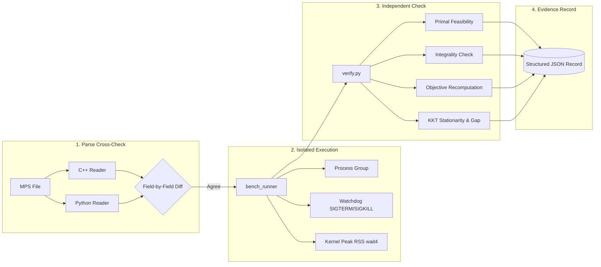

# Optimisation Solver

[](https://en.wikipedia.org/wiki/C%2B%2B17)
[](https://cmake.org/)
[](tests/)
[](LICENSE)
[](benchmarks/)

**An indigenous, modular mathematical optimization solver written in modern C++17 for linear programming (LP), mixed-integer linear programming (MILP), and convex quadratic programming (QP).**

---

### Smart India Hackathon (SIH 2026)

- **Organization:** Mangalore Refinery and Petrochemicals Limited (MRPL)
- **Problem Statement ID:** SIH26119
- **Problem Title:** Indigenous GPU-Accelerated Optimization Solver (Sovereign Alternative to Express / CPLEX)
- **Category:** Software
- **Theme:** Smart Automation

---

## Overview

Mathematical optimization is foundational across refinery operations, supply chain scheduling, pipeline dispatch, and industrial resource allocation. Commercial enterprise solvers (such as FICO Xpress and IBM CPLEX) are proprietary, closed-source, and subject to costly licensing fees and external software dependencies.

`optimisation_solver` provides an open-source, modular optimization engine built around sound numerical algorithms and clean software architecture. Rather than tightly coupling file parsing, presolve reductions, and numerical execution into a monolithic codebase, this project separates each stage into distinct modules with mathematically verified contracts:

> **Value Proposition:** A modular C++17 optimization solver with LP, MILP, and QP support, invertible presolve/postsolve coordinate reconstruction, multiple numerical engines, and an independent benchmark verification pipeline.

---

## Verified at a Glance

| Metric | Verified Value | Evidence & Scope |
| :--- | :---: | :--- |
| **Automated Test Targets** | **60 / 60** | All CTest targets pass (100% pass rate) with compiler assertions preserved across both Debug and Release builds (`-UNDEBUG`). |
| **Netlib LP Smoke Suite** | **8 / 8** | All 8 benchmark instances in the Netlib smoke suite are solved and independently verified (`optimal_verified`) by the combined solver portfolio. |
| **Hand-Crafted Reference Suite** | **11 / 11** | Hand-derived analytical test instances covering LP, QP, degenerate, ranged, and MILP formulations pass dual-reader parse checks and solve verification. |
| **Parser Cross-Check Coverage** | **67** | Benchmark fixtures evaluated across independent C++ and Python readers during parser verification (65 identical, 2 newly parsed in PR #8, 0 regressions). |

---

## Benchmark Evidence

The repository incorporates a reproducible, process-isolated benchmark harness (`benchmarks/bench.py`) that executes instances under strict OS-level watchdogs and verifies solutions against an **independent external checker** (`benchmarks/lib/verify.py`). Solutions are never evaluated based on the solver's self-reported status; all row activities, bound violations, and duality gaps are recomputed directly from the unscaled, original model.

### Netlib LP Smoke Benchmark

Evaluated on the standard Netlib LP smoke set using a 60.0-second time budget per instance (`benchmarks/results/netlib_smoke.json`):

| Instance | Dimensions (Rows × Cols) | Dual Simplex (`milp_engine`) | PDLP First-Order (`pdlp_engine`) | HiGHS Reference (`highs-ds`) |
| :--- | :---: | :--- | :--- | :--- |
| `adlittle` | 56 × 97 | **Optimal Verified** (0.005 s) | *No Point [Tolerance Stall]* (0.008 s) | **Optimal Verified** (0.707 s) |
| `afiro` | 27 × 32 | **Optimal Verified** (0.002 s) | **Optimal Verified** (0.002 s) | **Optimal Verified** (0.343 s) |
| `blend` | 74 × 83 | Feasible [Iter Limit] (0.021 s) | **Optimal Verified** (0.014 s) | **Optimal Verified** (0.341 s) |
| `degen2` | 444 × 534 | **Optimal Verified** (1.053 s) | **Optimal Verified** (0.308 s) | **Optimal Verified** (0.254 s) |
| `recipe` | 91 × 180 | **Optimal Verified** (0.016 s) | **Optimal Verified** (0.016 s) | **Optimal Verified** (0.295 s) |
| `sc50a` | 50 × 48 | **Optimal Verified** (0.002 s) | **Optimal Verified** (0.003 s) | **Optimal Verified** (0.237 s) |
| `sc50b` | 50 × 48 | **Optimal Verified** (0.002 s) | *No Point [Tolerance Stall]* (0.003 s) | **Optimal Verified** (0.234 s) |
| `share2b` | 96 × 79 | Feasible [Iter Limit] (0.063 s) | **Optimal Verified** (0.094 s) | **Optimal Verified** (0.305 s) |

#### Portfolio Observations

1. **Dual Simplex**: Independently verifies **6 / 8** instances. It quickly and accurately solves degenerate bases (`degen2`) and ill-scaled rows (`adlittle`, `sc50b`), but encounters simplex iteration limits on dense cycling models (`blend`, `share2b`).
2. **PDLP**: Independently verifies **6 / 8** instances. The first-order PDHG method excels on dense and networked formulations (`blend`, `share2b`), but hits numerical stalls at the tight feasibility boundary on `adlittle` and `sc50b`.
3. **Complementary Coverage**: The two engines are completely complementary. Where Dual Simplex reaches an iteration limit, PDLP succeeds; where PDLP encounters a tolerance boundary, Dual Simplex succeeds. **The combined solver portfolio independently verifies 8 / 8 (100%) of the Netlib smoke benchmark instances.**

### QP Verification

The hand-crafted benchmark suite (`benchmarks/instances/known/`) includes convex quadratic minimization (`convex_qp.mps`) and concave quadratic maximization (`max_qp.mps`) formulations. Solved via the ADMM engine (`qp_engine`), both instances receive `optimal_verified` from the independent checker by satisfying stationarity, complementary slackness, and duality gap tolerances against hand-derived KKT conditions (`benchmarks/results/known.json`). These serve as exact analytical fixtures rather than a claim of broad external QP benchmark coverage.

---

## Measured Performance & Memory

Execution time and peak resident set size (RSS) are measured by the POSIX `bench_runner` harness using monotonic clocks (`CLOCK_MONOTONIC`) and kernel process usage (`wait4(..., ru_maxrss)`):

| Configuration | Mean Wall Time | Mean Peak Memory (RSS) | Memory Range |
| :--- | :---: | :---: | :---: |
| **`optimsolver:pdlp`** | **0.056 s** | **1.98 MB** | 1.57 MB – 3.72 MB |
| **`optimsolver:dual_simplex`** | **0.146 s** | **2.83 MB** | 1.67 MB – 9.60 MB |
| **HiGHS Reference (`highs-ds`)** | **0.340 s** | **71.82 MB** | 68.30 MB – 80.28 MB |

> *Note on performance data: Measured by the repository's isolated benchmark harness on the current 8-instance Netlib smoke set. These figures are workload-specific and are not a general performance claim. The lower memory footprint reflects a native C++ runtime without external runtime environments.*

---

## Independent Verification Pipeline

A solver that checks its own output cannot provide reliable benchmark evidence. All benchmark instances run through a four-stage isolated verification pipeline:



### Frozen Verification Tolerances

Tolerances are frozen across all benchmark runs to guarantee fair comparisons:

| Check | Absolute Tolerance | Relative / Normalized Formula |
| :--- | :---: | :--- |
| **Row Feasibility** | `1e-6` | $\text{tol}_i = 10^{-6} + 10^{-8} \cdot \max(1, \|l_i\|, \|u_i\|, \sum_j \|a_{ij} x_j\|)$ |
| **Bound Feasibility** | `1e-6` | $\text{tol}_j = 10^{-6} + 10^{-8} \cdot \max(1, \|lb_j\|, \|ub_j\|, \|x_j\|)$ |
| **Integrality** | `1e-6` | $\|x_j - \text{round}(x_j)\| \le 10^{-6}$ (strict absolute) |
| **Optimality Gap** | `1e-6` | $\text{gap}_{\text{norm}} = \frac{\|p - d\|}{1 + \|p\| + \|d\|} \le 10^{-6}$ (minimization form) |

### Strict Status vs. Verdict Separation

The pipeline enforces an explicit separation between what the solver claims and what the checker proves:
- **Solver Termination Status:** `optimal`, `infeasible`, `unbounded`, `limit_reached`, `numerical_failure`.
- **Independent Checker Verdict:** `optimal_verified` (primal feasible and gap closed), `feasible` (primal feasible without dual proof), `infeasible_point` (model violated), `nonfinite` (contains NaN/Inf), `no_point` (timeout or crash), `not_applicable` (infeasibility/unboundedness claims).

---

## Architecture & Numerical Engines

```text
       MPS File (.mps)
              ↓
       Model IR (Linear, Quadratic, Bounds, Types)
              ↓
       Structural Validation (bounds, row indices)
              ↓
       Classification (LP / QP / MILP)
              ↓
       Presolve (Once) ───────── logs PresolveResult ─────────┐
              ↓                                               │
       Reduced Model                                          │
              ↓                                               │
       Solver Dispatch                                        │
       ├── PDLP (First-Order LP)                              │
       ├── Dual Simplex (Tableau LP)                          │
       ├── Branch-and-Cut (MILP)                              │
       └── ADMM QP (Quadratic Programming)                    │
              ↓                                               │
       Reduced SolveResult                                    │
              ↓                                               │
       Postsolve (Once) <─────────────────────────────────────┘
              ↓
       Original-Space Solution (Primal & Dual Reconstructed)
```

### The Single-Presolve Invariant

Presolve reductions (fixed variable elimination, singleton row removals, bound tightening with provenance tracking, and redundant constraint purging) execute **exactly once** on the original formulation. Coordinate transformations are logged in an audit record (`PresolveResult`). Postsolve consumes this audit record to reconstruct original coordinates and map shadow prices back to original constraints. Redundant presolving is strictly forbidden to prevent coordinate drift.

### Core Solver Engines

1. **PDLP Engine (`pdlp_engine/`):** Implements Primal-Dual Hybrid Gradient (PDHG) with Ruiz diagonal equilibration, adaptive step-size selection, and normalized duality gap restarts.
2. **Dual Simplex Solver (`milp_engine/`):** Tableau-based simplex algorithm delivering exact basic feasible solutions; serves as the root and node relaxation solver for integer programs.
3. **Branch-and-Cut Engine (`milp_engine/`):** Tree search with dynamic Gomory fractional cut generation, most-fractional branching, and primal rounding heuristics for Mixed-Integer Linear Programs (MILP).
4. **Convex QP Engine (`qp_engine/`):** Alternating Direction Method of Multipliers (ADMM) with augmented KKT system factorizations for convex quadratic objectives ($f(x) = \frac{1}{2} x^T P x + q^T x + \text{offset}$).

---

## Quick Start

### Installation

Clone the repository and run the automated installer:

```bash
git clone https://github.com/RaghavGupta2910/optimisation_solver.git
cd optimisation_solver
./install.sh
```

The installer verifies prerequisite tools (`cmake` and a C++17 compiler), builds the project in Release mode, installs the binary to `~/.local/bin/optimsolver`, and ensures the directory is present in your shell `PATH`.

### Developer Build (Manual CMake)

```bash
cmake -S . -B build -DCMAKE_BUILD_TYPE=Release
cmake --build build -j

# Run the automated test suite
ctest --test-dir build --output-on-failure
```

---

## Command-Line Usage

The solver provides both an interactive terminal menu and a non-interactive batch solve interface:

```bash
# 1. Interactive Terminal Interface
optimsolver

# 2. Direct Batch Solve
optimsolver solve <model.mps> [options]
```

### Batch Solve Flags

```text
Arguments:
  <model.mps>             Path to input problem file in MPS format (required)

Options:
  --solver <name>         Select engine: pdlp, dual_simplex, branch_and_cut, qp
  --time-limit <seconds>  Maximum solve time budget in seconds
  --output <file>         Write reconstructed solution text to file
  --json <file>           Export structured JSON solve record
  --dump-model <file>     Dump parsed model as JSON for parse verification
  --threads <n>           Worker thread count (0 = auto, 1 = serial)
  -h, --help              Show help message
```

#### Example Commands

```bash
# Solve with automatic engine routing
optimsolver solve tests/cli/simple_lp.mps

# Solve using specific engine with time limit and JSON export
optimsolver solve benchmarks/instances/netlib/afiro.mps \
    --solver dual_simplex \
    --time-limit 30 \
    --json solution.json

# Dump parsed model IR for verification
optimsolver solve benchmarks/instances/known/opt_lp.mps \
    --dump-model dump.json
```

---

## Testing & Pipeline Verification

```bash
# 1. Run all 60 CTest automated targets
ctest --test-dir build --output-on-failure

# 2. Run the independent benchmark pipeline self-test
python3 benchmarks/test_pipeline.py

# 3. Execute Netlib smoke benchmarks (requires Python 3 + SciPy)
python3 benchmarks/bench.py benchmarks/instances/netlib/afiro.mps \
    --solvers dual_simplex,pdlp,highs --timeout 60 \
    --best-known benchmarks/instances/netlib/best_known.json \
    --out benchmarks/results/netlib_afiro.json
```

---

## Known Limitations & Roadmap

In adherence to scientific integrity and open engineering:

- **GPU Acceleration (Roadmap):** GPU/CUDA linear algebra kernels for matrix-vector multiplication in PDLP and ADMM QP are planned architecture enhancements and are not yet active in the current release.
- **Infeasibility / Unboundedness Certification:** Infeasibility and unboundedness are reported by the solver engines, but independent Farkas ray certificates are not yet certified by the external checker.
- **MILP Dual Bounding:** Branch-and-cut guarantees integer feasibility and cost evaluation (`feasible`), while complete global dual bound certification is in active development.
- **PDLP Boundary Tuning:** Numerical convergence at tight relative tolerances ($10^{-8}$) on ill-conditioned bases remains an active area of parameter tuning.
- **Additional Formats:** Support for LP file formats (`.lp`) alongside existing MPS fixed and free format ingestion.

---

## Documentation Index

- **[System Architecture](docs/architecture.md):** In-depth engineering specifications on pipeline contracts, coordinate spaces, and numerical algorithms.
- **[User Guide](USER_GUIDE.md):** Comprehensive operational manual covering build workflows, MPS specifications, and troubleshooting.
- **[Benchmark Guide](benchmarks/README.md):** Methodological details on frozen tolerances, process isolation, and the independent checker.
- **[SIH Presentation Deck](submission/PRESENTATION.md):** Project slide deck documentation and cloud backup links.
- **[SIH Demonstration Script](submission/DEMO.md):** Demonstration video walkthrough guide.

---

## Team

- **Raghav Gupta** — Team Lead — System Architecture, Solver Orchestration & CLI
- **Harehar Narayan Seth** — Lead Numerical Solver Development & Optimization Algorithms
- **Aryan Kumar** — Solver Engine Development & Numerical Methods
- **Preetish Attray** — MILP / Branch-and-Cut Development
- **Kabir Pahwa** — Postsolve, Dual Reconstruction & Solution Validation
- **Sarisha Jhinghan** — Presolve, Model Processing & Testing

---

## License

This project is licensed under the [MIT License](LICENSE).

## Smooth nonlinear programming

The `nlp_engine` module provides an elastic SQP solver, expression DAG with
reverse automatic differentiation, sparse Jacobians, and a callback API. It
reuses the QP engine and reports verified **first-order stationarity**, not
global optimality. `FirstOrderStationary` means the returned point satisfies the
implemented original-unit KKT residual checks; it does not imply LICQ, MFCQ or
another constraint qualification, and multiplier uniqueness is not guaranteed.
Run `optimsolver solve-nlp model.nlp`; see the
[NLP architecture, API, numerical limits, and examples](nlp_engine/README.md).
