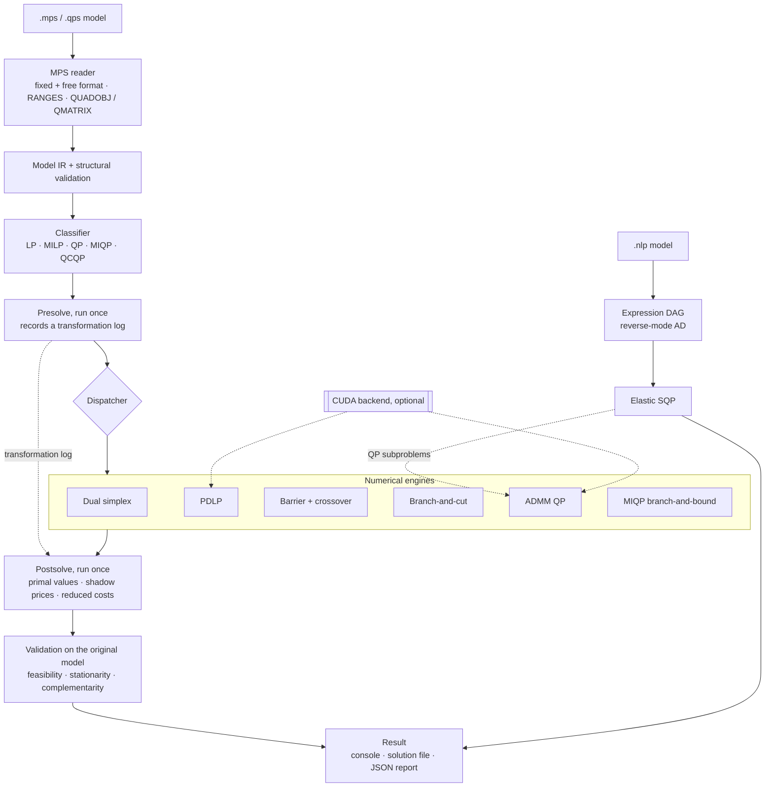
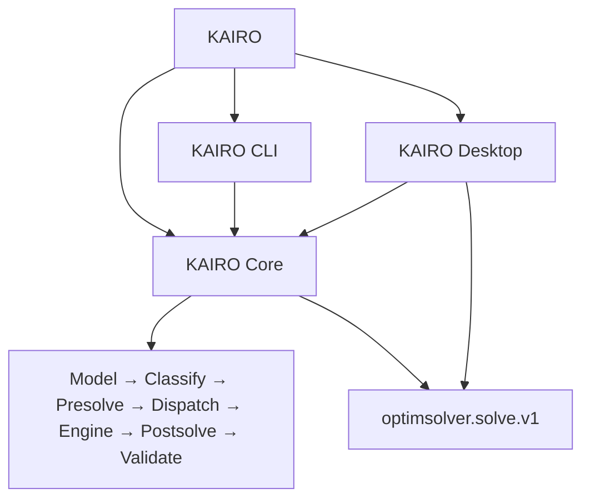
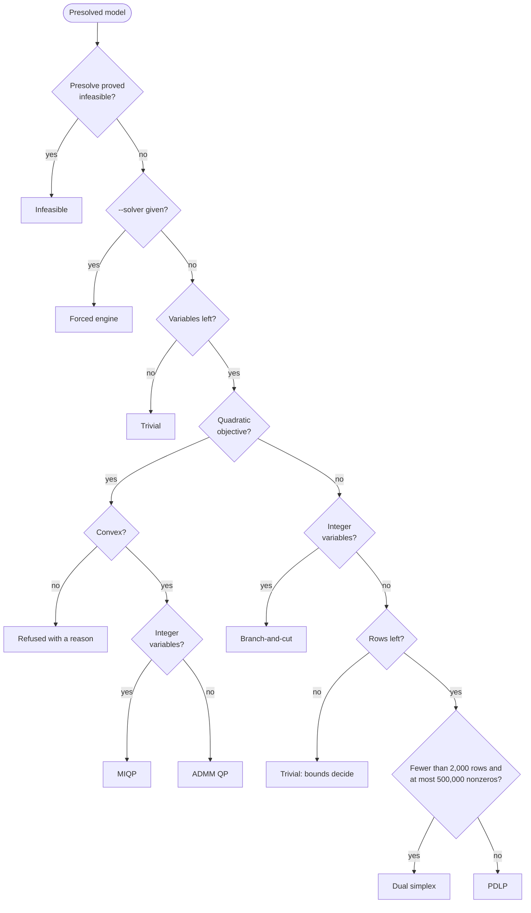
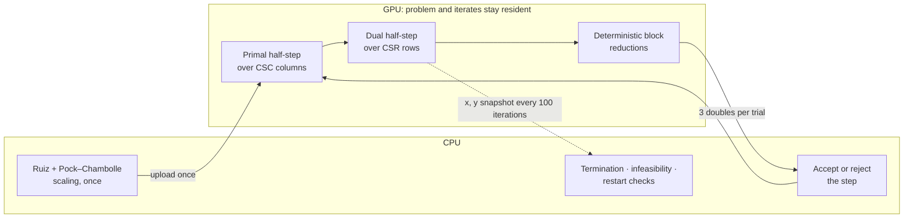
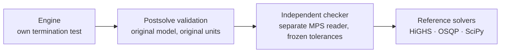

<div align="center">

# OptimSolver

### An indigenous optimisation solver for LP, MILP, convex QP, convex MIQP and smooth NLP

Seven numerical engines written from the published mathematics in C++17 · optional CUDA backend · an independent verifier behind every benchmark verdict


[](LICENSE)

**Smart India Hackathon 2026 · Problem Statement SIH26119 · Mangalore Refinery and Petrochemicals Ltd (MRPL)**<br>
*Indigenous GPU-Accelerated Optimization Solver (Sovereign Alternative to Express / CPLEX)* · Software · Smart Automation

</div>

---

Refinery planning, crude blending and scheduling are solved as linear, mixed-integer and quadratic programs, and the commercial solvers used for them are proprietary, licensed and a foreign technology dependency. **OptimSolver** is an indigenous alternative built from the algorithms up. It reads a model, presolves it once, routes it to the engine that fits its structure, and returns the solution **with shadow prices and reduced costs for the original constraints and variables**, checked against the original model before it is reported as optimal.

Every engine (dual simplex, primal–dual interior point, first-order PDHG, ADMM, branch-and-cut, SQP) and every sparse factorisation beneath them is implemented in this repository. **No solver or linear-algebra library is linked.** HiGHS and OSQP appear only as reference solvers in the benchmark harness, where they run as separate processes.

> **Status:** validated on the public test sets below, with every failure listed, and under active development. It is not yet a drop-in replacement for CPLEX or Xpress on speed or scale; see [Limitations](#limitations).

## At a glance

Measured 2026-10-01 on `main` (`1a00f09`): Release build, Apple M3, one thread per solve, each solve in its own process. A **verified** result is the [independent checker's](#correctness--validation) verdict on the original model, not the solver's own status. The per-instance record is in [benchmarks/results/RESULTS_2026-10-01.md](benchmarks/results/RESULTS_2026-10-01.md).

| | Result |
|---|---|
| **Problem classes** | LP · MILP · convex QP · convex MIQP · smooth NLP, from one binary with automatic engine selection |
| **Netlib LP**, 8 frozen instances | barrier **8/8** verified optimal · dual simplex 6/8 · PDLP 6/8 · HiGHS reference 8/8 |
| **Maros–Mészáros QP**, 14 frozen instances | barrier **14/14** verified optimal · ADMM 12/14 · OSQP reference 14/14 |
| **Maros–Mészáros QP**, all 138 instances | barrier: **93/134** solved to the published objective at 60 s, 62 of them with KKT conditions independently verified · **0 wrong "optimal" claims** · 32 large instances time out |
| **MIPLIB 2017**, 25 frozen instances, 60 s | branch-and-cut proves **4/25** optimal and reaches the best-known objective on 6 · HiGHS reference proves 8/25 · **1 incorrect `Infeasible`** (`ta1-UUM`, an open defect) |
| **Randomised QPs vs OSQP** | **300/300** accounted for: 279 agree on objective and solution, 21 infeasible/unbounded statuses corroborated |
| **Test suite** | **78/78** CTest targets pass in Release, 0 compiler warnings |
| **GPU** | CUDA backend for PDLP (whole iteration on the device) and ADMM QP (hybrid); off by default |
| **Code** | ≈29,000 lines of C++17/CUDA and ≈14,700 lines of C++ tests, with no third-party solver code |

## Why OptimSolver

- **Built, not wrapped.** Sparse storage, scaling, LDLᵀ and Cholesky factorisations, simplex pivoting, interior-point path following, PDHG, ADMM, cutting planes and the branch-and-bound tree are all in this repository. The only optional external dependency is the CUDA toolkit.
- **Checked before it is called optimal.** Postsolve maps every result back to the original model and validates it there. If the primal point fails, the solve is reported as `NumericalFailure`, never `Optimal`, and the point is withheld. If the duals fail the stationarity or complementarity check, they are withheld with the reason instead of being returned.
- **Shadow prices that refer to your constraints.** Presolve removes rows and tightens bounds. Postsolve replays the same transformation log in reverse and attributes each dual to the original row it came from. These are the marginal values of the constraints a planner wrote: crude availability, unit capacity, product specification.
- **The right method for the problem.** Small LPs go to the dual simplex (exact vertex, exact duals), large ones to PDLP (no factorisation), QPs to ADMM and integer models to branch-and-cut. The interior-point engine is available for LP and QP on request. Nonconvex quadratics are refused with a reason instead of being solved wrongly.
- **Statuses that mean what they say.** Running out of time is `LimitReached`, not `Infeasible`. The NLP engine reports `FirstOrderStationary`, not "optimal". A CUDA request that cannot run on a GPU fails with the reason instead of silently falling back to the CPU.
- **Measured the hard way.** Instance selections were frozen before any run and are never swapped after a failure. Tolerances are frozen. Each solve runs in its own process under a watchdog, and failures are published next to successes.

## Architecture



A solve runs in six stages:

1. **Parse.** `mps::MpsReader` reads fixed or free MPS, including `RANGES`, every bound type, integer markers, `OBJSENSE` and quadratic objectives. Anything it cannot represent stops the parse rather than silently changing the model.
2. **Classify** the original model before presolve, because presolve's reductions depend on the problem class.
3. **Presolve once.** It removes zero coefficients, fixed variables, singleton rows, redundant rows, and duplicate or parallel rows. It also tightens bounds with recorded provenance and detects simple infeasibility. Every reduction is logged.
4. **Dispatch** on the reduced model, because presolve changes the size, can remove every integer variable, or can prove infeasibility outright.
5. **Solve** in reduced coordinates with the selected engine.
6. **Postsolve once**, using the same log, then validate the primal and dual solution in original coordinates.

Presolve and postsolve each run **exactly once** and share one transformation log. Running presolve twice would make the coordinates drift, and dual reconstruction needs the exact history of every reduction. [docs/architecture.md](docs/architecture.md) has the full design.

## KAIRO v1 — Native Desktop Product

This repository holds the numerical optimisation core historically documented as **OptimSolver**: the pipeline, engines, benchmarks and validation described in the rest of this README. **KAIRO** (*Kernel for Advanced Integer & Real Optimization*) is the name of the product built on that core. It has a command-line interface (KAIRO CLI, the `optimsolver` binary) and, since KAIRO v1, a native, installable desktop application (**KAIRO Desktop**, in [`desktop/`](desktop/)). Everything above about the solver applies unchanged: KAIRO Desktop adds no solver logic of its own.



| Part | What it is |
|---|---|
| **KAIRO Core** | Model IR, MPS parsing and structural validation, classification, presolve, dispatcher, numerical engines, postsolve and validation, reached through `solver::solve(...)` |
| **KAIRO CLI** | The interactive and batch command-line interface (`optimsolver`) |
| **KAIRO Desktop** | A native Qt 6 / C++17 GUI, built with CMake, for macOS, Windows and Linux |

**One solver.** The CLI and the desktop use the same KAIRO Core. The desktop calls `solver::solve(model, options, &report)` **in-process**, because it links the core libraries directly. KAIRO's own record writer then turns that call's result and report into an `optimsolver.solve.v1` record, the same record `optimsolver solve --json` writes. That record is the boundary between the solver and the desktop's analysis views. The desktop does not repeat classification, presolve, dispatch, validation or any solver logic, and it does not parse CLI text.

**Local and offline.** KAIRO Desktop has no browser, HTTP server, localhost port, cloud service or network dependency, and needs no Python or JavaScript at runtime.

**What the desktop does:**
- Opens `.mps`/`.qps` models.
- Sets the engine, compute backend (and CUDA device), time limit and threads, then solves.
- Shows the result with its supporting evidence, the solver pipeline, model analysis, presolve impact, the dispatch decision and execution, and validation details.
- Saves runs locally: each saved run is KAIRO's record, never a copy of the model file.
- Exports and imports `optimsolver.solve.v1` records. Imported records are data only and are never re-solved.
- Compares two runs. Runs count as the same model only when the input SHA-256 values KAIRO recorded match. The comparison reports recorded differences, never a "winner", "better" or "best".
- Follows the system's light or dark appearance.

**Trust wording is deliberately conservative.** The desktop says only what KAIRO's record supports: *Checked*, *Not checked*, *Not available*, *Verified by KAIRO validation*, *Proved by presolve*, *Reported by engine*, *Optimality not established*, and *Global optimality evidence not independently recorded*. An optimal integer result reads "Optimal — according to the solver". A relaxation reads "Optimal for the continuous relaxation".

### KAIRO v1 — Platform Support

KAIRO is a native, cross-platform desktop application. KAIRO Desktop communicates with KAIRO Core directly, in-process. It uses the same KAIRO Core as the KAIRO CLI. It has no browser, local web server, Python runtime, JavaScript runtime or cloud dependency.

| Platform | KAIRO v1 |
|---|---|
| macOS | Supported |
| Windows x64 | Supported |
| Linux x64 | Supported |
| Windows ARM64 | Not supported in KAIRO v1 |
| Linux ARM64 | Not supported in KAIRO v1 |

**Current limitations:**
- macOS release builds are ad hoc signed, not Developer ID signed or notarized.
- A running solve cannot be cancelled; a time limit bounds how long a solve runs.
- Windows ARM64 and Linux ARM64 are not supported.
- KAIRO v1 does not claim production readiness or industrial-scale performance.
- KAIRO does not claim superiority over, or equivalence to, commercial solvers such as CPLEX or Xpress. The [Limitations](#limitations) below still apply.

## Download KAIRO

KAIRO is available as a native desktop application. Download it from the **[KAIRO v1.0.0 release](https://github.com/RaghavGupta2910/optimisation_solver/releases/tag/v1.0.0)**:

| Platform | Download |
|---|---|
| macOS | Disk image (`.dmg`) |
| Windows x64 | ZIP archive (`.zip`) |
| Linux x86-64 | AppImage (`.AppImage`) |

## Engines

| Engine | `--solver` | Solves | Method | Notable techniques | Backend |
|---|---|---|---|---|---|
| **Dual simplex** | `dual_simplex` | LP (automatic below 2,000 rows); node LPs in branch-and-cut | Bounded-variable revised dual simplex on `[A \| −I]` | Dual steepest-edge pricing, product-form basis updates, warm start from a basis, exact vertex and duals | CPU |
| **PDLP** | `pdlp` | Large LP | Primal–dual hybrid gradient (Applegate et al., 2021) | Ruiz + Pock–Chambolle scaling, adaptive step size, restarts, iterate averaging, infeasibility detection, feasibility polishing, multithreaded | CPU · **CUDA** |
| **Barrier** | `barrier` | LP, convex QP | Infeasible primal–dual interior point (Mehrotra, 1992) | Gondzio correctors, regularised quasidefinite augmented system, sparse LDLᵀ with AMD ordering, inertia check, iterative refinement, crossover to a vertex (LP), active-set polishing (QP) | CPU |
| **Branch-and-cut** | `branch_and_cut` | MILP | LP-based branch-and-bound | Root Gomory mixed-integer cuts, pseudo-cost branching, rounding and diving heuristics, multithreaded tree search, warm-started node LPs | CPU |
| **ADMM QP** | `qp` | Convex QP | Operator splitting (Stellato et al., 2020) | Dense or sparse Cholesky of the KKT system, Ruiz scaling, damped adaptive ρ, infeasibility certificates, solution polishing, original-unit termination | CPU · **CUDA** hybrid |
| **MIQP** | `miqp` | Convex MIQP | Branch-and-bound over QP relaxations | Convexity verified before dispatch, relaxations solved by the ADMM engine | CPU |
| **Elastic SQP** | `nlp` | Smooth NLP (local) | Sequential quadratic programming with elastic constraints | Expression DAG with reverse-mode AD, damped BFGS, QP subproblems solved by the ADMM engine | CPU |

### Automatic engine selection



`.nlp` files go to the elastic SQP engine. The barrier engine is opt-in (`--solver barrier`) until benchmarks justify an automatic rule. The 2,000-row limit exists because the dual simplex keeps a dense basis inverse: 32 MB at 2,000 rows, but 20 GB at 50,000.

## CUDA backend

GPU execution is optional and covers the two engines whose iterations are dominated by sparse products and vector updates.

| Engine | On the GPU | On the CPU |
|---|---|---|
| **PDLP** | The whole PDHG iteration: both fused half-steps, linesearch reductions, averaging, restarts | Scaling and preconditioning once, before iterating; termination and infeasibility checks every 100 iterations |
| **ADMM QP** (hybrid) | `A x`, `Aᵀ y`, `P x` (cuSPARSE), right-hand side, projection, dual update, residual norms | KKT factorisation and triangular solves, ρ adaptation, certificates, polishing |
| Dual simplex, barrier, branch-and-cut, MIQP, NLP | — | Everything; a `--backend cuda` request on these says so in the result |



What the backend guarantees:

- **The same arithmetic on CPU and GPU.** The per-coordinate PDHG math is one `__host__ __device__` source, so NaN propagation and comparison order match.
- **IEEE semantics, double precision throughout.** The build forces `--prec-div=true --prec-sqrt=true --ftz=false`, and configuring with `--use_fast_math` is a configure error.
- **Reproducible reductions.** There are no floating-point atomics: block partials are summed in index order, so results repeat run to run on a given device.
- **No silent fallback.** `--backend cuda` either runs on the GPU or fails with the reason. `--backend auto` records why it chose the CPU. The backend that actually ran is written to the JSON report.

**Status.** The CUDA build was validated by its author on Windows (Visual Studio 2022, CUDA 13.4, NVIDIA RTX 5050 Laptop GPU):

- fresh Release build;
- `pdlp_cuda_tests` and `qp_cuda_tests` passing;
- Compute Sanitizer memcheck and initcheck reporting 0 errors for both engines.

The details are in [PR #19](https://github.com/RaghavGupta2910/optimisation_solver/pull/19). On machines without a GPU, the CUDA tests report *skipped* rather than passing. CPU-versus-GPU timings are [below](#cpu-pdlp-vs-cuda-pdlp); `tools/cuda/validate_cuda.ps1` reruns the whole validation (builds, tests, sanitizers, repeated runs) in one command. Build and validation steps are in [docs/cuda.md](docs/cuda.md).

## Benchmarks

**Method.**

- Every solve runs in an isolated process under a watchdog that kills the whole process group. Peak memory comes from the kernel (`wait4`).
- OptimSolver engines run single-threaded.
- Verdicts come from [`benchmarks/lib/verify.py`](benchmarks/lib/verify.py), which re-reads each model with its own MPS parser and recomputes residuals and the duality gap on the original model.
- Frozen tolerances: feasibility 1e-6 absolute + 1e-8 relative, integrality 1e-6, normalised optimality gap 1e-6.
- Instance selections were frozen before any run.
- References: HiGHS 1.15.1 (native binary) and OSQP 1.1.3. Neither is linked into the solver.
- Platform: Apple M3, macOS 15.3.1, Apple clang 15, Release (`-O3`).

### LP: Netlib

| Instance | Rows × cols | Dual simplex | PDLP | Barrier | HiGHS 1.15.1 |
|---|---|---|---|---|---|
| adlittle | 56 × 97 | ✅ 0.018 s | ◐ 0.015 s | ✅ 0.013 s | ✅ 0.033 s |
| afiro | 27 × 32 | ✅ 0.003 s | ✅ 0.003 s | ✅ 0.003 s | ✅ 0.004 s |
| blend | 74 × 83 | ⚠️ stalls at 0 | ✅ 0.017 s | ✅ 0.020 s | ✅ 0.005 s |
| degen2 | 444 × 534 | ✅ 1.276 s | ✅ 0.496 s | ✅ 0.564 s | ✅ 0.022 s |
| recipe | 91 × 180 | ✅ 0.027 s | ✅ 0.026 s | ✅ 0.030 s | ✅ 0.005 s |
| sc50a | 50 × 48 | ✅ 0.004 s | ✅ 0.005 s | ✅ 0.005 s | ✅ 0.004 s |
| sc50b | 50 × 48 | ✅ 0.004 s | ◐ 0.005 s | ✅ 0.004 s | ✅ 0.004 s |
| share2b | 96 × 79 | ⚠️ 9.9 % short | ✅ 0.164 s | ✅ 0.113 s | ✅ 0.006 s |
| **Verified optimal** | | **6/8** | **6/8** | **8/8** | **8/8** |

✅ optimality independently verified · ◐ feasible and matches the published objective, optimality not proven at 1e-6 · ⚠️ feasible, but the solver stopped before the optimum (the dual simplex has no dual Phase 1 yet; the optimum of `blend` is −30.81). Times are wall-clock for the whole process.

The barrier engine reaches an exact vertex through crossover on six of the eight instances. HiGHS remains far faster: on `degen2`, the largest instance, it is about 25× faster than our barrier.

### QP: Maros–Mészáros

The 14-instance frozen smoke set, with published objectives as ground truth:

| | ADMM (`qp`) | Barrier | OSQP 1.1.3 (reference) |
|---|---|---|---|
| **Verified optimal** | **12/14** | **14/14** | **14/14** |
| Slowest instance | 0.39 s (`cvxqp1s`) | 0.009 s (`cvxqp3s`) | — |

ADMM misses two instances:

- **`cvxqp1s`:** the duality gap closes to 4e-10, but one multiplier's sign is off by 1.02e-6, just over the checker's 1e-6 threshold.
- **`cvxqp3s`:** the solver hits its iteration limit because ADMM uses one scalar ρ for every row.

OSQP times include Python start-up, so they are not compared.

**Full set, barrier engine, 60 s per instance.** Four instances (`exdata`, `qforplan`, `qgfrdxpn`, `values`) were not run, because the independent verifier's own MPS reader rejects them and their results could not be checked. Of the other 134:

| Outcome | Instances |
|---|---:|
| Optimal, matches the published objective, KKT conditions independently verified | **62** |
| Optimal, matches the published objective, optimality not independently verified¹ | 31 |
| Did not finish in 60 s; stopped by the watchdog (all on instances with 2,597 or more variables) | 32 |
| Numerical failure, reported as such | 5 |
| Stopped without converging (iterates diverged on 3, stalled on 1), reported as `LimitReached`, not as infeasible | 4 |
| **Optimal claimed with a wrong objective** | **0** |

¹ In 19 cases postsolve withheld the duals because they failed its own optimality check. In the other 12, the returned duals miss the checker's multiplier-sign or complementarity test.

All 93 `Optimal` claims match the published objective. The time-outs reflect the serial, simplicial factorisation (see [Limitations](#limitations)). In a separate 60 s run on 2026-09-30, using the pipeline protocol in [COVERAGE.md](benchmarks/COVERAGE.md), the ADMM engine matched 45 published objectives with no false optimal claims.

### MILP: MIPLIB 2017

The 25-instance development selection, frozen in `FROZEN_DEV25.json` before any run, at 60 s per instance and one thread. For integer programs, the checker verifies feasibility and integrality. Matching the MIPLIB best-known objective is corroboration, not a proof.

| Outcome | Branch-and-cut | HiGHS (SciPy 1.17.1, reference) |
|---|---:|---:|
| Proved optimal, matches the best-known objective | **4** | 8 |
| Best-known objective found, optimality not proved in 60 s | 2 | 5 |
| Feasible point, stopped at the time limit | 14 | 11 |
| No point within 60 s | 4 | 1 |
| **Incorrect `Infeasible` claim** | **1** | 0 |

Every point branch-and-cut returned passed the independent feasibility and integrality check. One result is wrong: on `ta1-UUM`, branch-and-cut reports the model infeasible after 1.6 s, although its LP relaxation solves to optimality and HiGHS finds an integer-feasible point. This is an open defect in the tree search. Two of the runs with no point (`neos-3530903-gauja`, `neos-3530905-gaula`) did not stop at their own time limit and were killed by the watchdog. MILP is the least mature area of the solver.

### Smoke protocol: 50 instances, 5 s each

`benchmarks/run_suites.py` runs every frozen selection through automatic engine selection, with a 5-second budget per solver process. It is a fast regression gate, not a performance ranking. A result counts as **agreeing** only when the point is independently feasible, both solvers report optimal, and the objectives agree to 1e-6.

| Selection | Instances | Agree | Other outcomes |
|---|---:|---:|---|
| Netlib LP | 8 | 6 | 2 feasible, not optimal (`blend`, `share2b`) |
| MIPLIB 2017 subset | 25 | 3 | 14 reference also not optimal in 5 s · 6 unverified · 2 feasible, not optimal |
| Maros–Mészáros QP | 14 | 13 | 1 iteration limit (`cvxqp3s`) |
| Mittelmann LP subset | 3 | 0 | 3 time-limited |
| **Total** | **50** | **22** | |

### PDLP thread scaling

Measured by the CUDA backend's author on an Intel Core i7-13645HX: synthetic LPs generated by `pdlp_bench`, 1,000 iterations, median of three runs (from [docs/cuda.md](docs/cuda.md#cpu-baseline-on-the-development-machine-earlier-mingw)).

| LP size | Nonzeros | 1 thread | 20 threads | Speed-up |
|---|---:|---:|---:|---:|
| 20,000 × 40,000 | 199,978 | 0.765 s | 0.132 s | 5.8× |
| 100,000 × 200,000 | 999,977 | 20.37 s | 3.26 s | 6.2× |

### CPU PDLP vs CUDA PDLP

End-to-end PDLP solves to the default 1e-6 tolerances on synthetic feasible LPs (`pdlp_bench`, fixed seed, `rows × 2·rows` columns, 10 nonzeros per row, polishing off). Every solve on both backends ended `optimal`.

- **Hardware:** Intel Core i7-13645HX (20 hardware threads), NVIDIA GeForce RTX 5050 Laptop GPU (compute capability 12.0), Windows 11, CUDA Toolkit 13.4, MSVC.
- **Build:** Release, double precision throughout.
- **Method:** 1 untimed warm-up, then 5 timed runs per backend; the median wall time of the complete solver call is reported. CUDA times include device setup, transfers in both directions, all kernels and reductions, and the host-side checks.
- **CPU threads:** fixed at 12. With all 20 threads the CPU timings on this laptop were bimodal (up to 8× between runs of the same solve), which made CUDA look better than it is. That series is published in full in [docs/cuda.md](docs/cuda.md#9-benchmarks).

| Instance | NNZ | CPU | CUDA | Speedup | Objective Error |
|---|---:|---:|---:|---:|---:|
| 1,000 × 2,000 | 9,977 | 0.074 s | 0.359 s | 0.21× | 1.6e-05 |
| 10,000 × 20,000 | 99,976 | 0.464 s | 1.262 s | 0.37× | 2.2e-05 |
| 25,000 × 50,000 | 249,972 | 0.975 s | 1.493 s | 0.65× | 6.9e-05 |
| 50,000 × 100,000 | 499,974 | 2.313 s | 2.529 s | 0.91× | 5.5e-05 |
| 75,000 × 150,000 | 749,971 | 4.764 s | 4.073 s | 1.17× | 2.6e-05 |
| 100,000 × 200,000 | 999,977 | 8.178 s | 5.480 s | 1.49× | 4.3e-06 |
| 150,000 × 300,000 | 1,499,978 | 16.746 s | 7.667 s | 2.18× | 1.5e-04 |
| 200,000 × 400,000 | 1,999,974 | 24.762 s | 9.845 s | 2.52× | 2.6e-05 |
| 500,000 × 1,000,000 | 4,999,978 | 75.848 s | 26.256 s | 2.89× | 1.7e-04 |

Speedup is CPU time / CUDA time; objective error is |CPU objective − CUDA objective|, at most 6e-9 relative to the objective. The CPU is faster up to 500k nonzeros; CUDA is faster from 750k and its lead grows with size. `--backend auto` therefore keeps its 1,000,000-nonzero threshold, the first size with a clear CUDA margin. This crossover is specific to this machine. The QP backend, which keeps its KKT factorisation on the CPU, measured 0.45×–1.02× of the CPU and is never chosen automatically. Raw data is in [`benchmarks/results/cuda/`](benchmarks/results/cuda/); `benchmarks/cuda/run_cuda_benchmarks.ps1 -BuildDir <build> -Threads 12` reproduces it.

<details>
<summary><b>Reproduce these results</b></summary>

```bash
cmake -S . -B build-release -DCMAKE_BUILD_TYPE=Release
cmake --build build-release -j

# Public instances, checked against pinned SHA-256 manifests
python3 benchmarks/fetch_netlib.py --set smoke
python3 benchmarks/fetch_miplib.py FROZEN_DEV25.json
python3 benchmarks/fetch_suites.py --suite qp --full
python3 benchmarks/fetch_suites.py --suite mittelmann

RUN="--binary build-release/optimsolver --runner build-release/bench_runner --timeout 60 --threads 1"

# LP: Netlib, every LP engine plus HiGHS
python3 benchmarks/bench.py benchmarks/instances/netlib/mps/*.mps $RUN --out netlib.json \
    --solvers dual_simplex,pdlp,barrier,highs --best-known benchmarks/instances/netlib/best_known.json

# QP: all Maros–Mészáros instances, barrier engine
python3 benchmarks/bench.py benchmarks/instances/qp/mps/*.mps $RUN --out qp.json --solvers barrier

# MILP: MIPLIB development selection, branch-and-cut, then the HiGHS reference
python3 benchmarks/bench.py benchmarks/instances/miplib/mps/*.mps $RUN --out bnc.json \
    --solvers branch_and_cut --best-known benchmarks/instances/miplib/best_known_FROZEN_DEV25.json
python3 benchmarks/bench.py benchmarks/instances/miplib/mps/*.mps $RUN --out highs.json \
    --solvers highs --highs-backend scipy --best-known benchmarks/instances/miplib/best_known_FROZEN_DEV25.json

# Smoke protocol over every frozen selection
python3 benchmarks/run_suites.py --suite all --timeout 5 \
    --binary build-release/optimsolver --runner build-release/bench_runner --out suites.json
```

The per-instance results of every run above, with the raw JSON, are in [benchmarks/results/RESULTS_2026-10-01.md](benchmarks/results/RESULTS_2026-10-01.md). Protocols and known failures are in [benchmarks/README.md](benchmarks/README.md) and [benchmarks/COVERAGE.md](benchmarks/COVERAGE.md).

</details>

## Correctness & validation



Each layer trusts nothing from the one before it. The engine decides when to stop, and postsolve re-checks the answer on the original model. In benchmarks, a separate Python reader and verifier recompute everything again. Reference solvers corroborate the objective and status, and a disagreement is reported, never averaged away.

| Area | CTest targets | What they pin down |
|---|---:|---|
| Postsolve and dual reconstruction | 40 | Shadow prices and reduced costs through every presolve reduction, sign conventions, provenance errors, non-finite values |
| Presolve | 6 | Each reduction, cascades, adversarial models, transformation metadata |
| Pipeline, dispatch and backends | 7 | End-to-end solves, engine contracts, QP sign conventions, CPU/CUDA selection and JSON provenance |
| LP, barrier, QP and MIQP engines | 7 | Known optima, degenerate and badly scaled problems, infeasible and unbounded detection, LDLᵀ inertia, ρ adaptation |
| MILP | 5 | Enumeration cross-checks, branching, Gomory cut validity, heuristics |
| NLP | 5 | Elastic KKT conditions, derivative checks, CLI, SciPy SLSQP comparisons |
| Reference comparisons | 2 | 300 randomised QPs against OSQP; reference-adapter conventions |
| Parser, CLI and benchmark harness | 6 | MPS edge cases, CLI parsing and reporting, process isolation, suite accounting |
| **Total** | **78** | **78/78 pass** (Release, with `PDLP_BUILD_TESTS`, `QP_BUILD_TESTS`, `QP_REFERENCE_TESTS` and `NLP_REFERENCE_TESTS` on) |

How defects are handled:

- **Reproduce, fix, then pin.** Each engine defect found in the QP and barrier reviews was reproduced on a concrete instance before it was changed, and each fix is pinned by a regression test shown to fail on the old code. Examples: an unfrozen ρ that left ADMM in a limit cycle, and a scaled-residual test that let 31 of 400 random QPs report `Optimal` while failing an original-units check.
- **Mutation-tested barrier.** The barrier's tests were run against 17 deliberately broken versions of the solver and caught 16. The survivor is documented.
- **Failures stay in the published record.** None is relabelled as expected; see [benchmarks/COVERAGE.md](benchmarks/COVERAGE.md).

## Capabilities

| Capability | Status |
|---|---|
| LP | ✅ dual simplex · PDLP · barrier |
| MILP | ✅ branch-and-cut |
| Convex QP | ✅ ADMM · barrier |
| Convex MIQP | ✅ branch-and-bound over QP relaxations |
| Smooth NLP | ✅ local first-order solutions (elastic SQP) |
| Nonconvex QP, QCQP | ➖ detected and refused with a reason |
| Shadow prices and reduced costs | ✅ LP and QP, in original coordinates |
| Exact vertex (basic) solutions | ✅ dual simplex; barrier through crossover |
| Infeasibility certificates | ✅ PDLP, ADMM · ➖ barrier, NLP |
| Warm start | ✅ dual simplex from a basis (used for branch-and-bound node LPs) |
| Multithreading | ✅ PDLP, branch-and-cut tree |
| GPU | ✅ PDLP; ADMM QP (hybrid) · CUDA, optional build |
| Input formats | ✅ MPS (fixed and free), QPS quadratic sections, `.nlp` · ➖ LP format |
| Output | ✅ console summary, solution file, structured JSON report |
| Interfaces | ✅ KAIRO Desktop (native Qt 6 app: macOS, Windows, Linux), interactive terminal UI, batch CLI, C++ library (`solver::solve`) |

## Quick start

**Requirements:** CMake ≥ 3.20 and a C++17 compiler (GCC, Clang or MSVC). For the GPU build, also the CUDA Toolkit and an NVIDIA GPU.

```bash
git clone https://github.com/RaghavGupta2910/optimisation_solver.git
cd optimisation_solver
./install.sh                     # Release build, installs to ~/.local/bin/optimsolver
optimsolver solve tests/cli/simple_lp.mps
```

Developer build and tests:

```bash
cmake -S . -B build -DCMAKE_BUILD_TYPE=Release
cmake --build build -j
ctest --test-dir build --output-on-failure
```

GPU build:

```bash
cmake -S . -B build-cuda -DCMAKE_BUILD_TYPE=Release -DOPTIMSOLVER_ENABLE_CUDA=ON
cmake --build build-cuda -j
```

### KAIRO Desktop

KAIRO Desktop is a native Qt 6 application that runs the solver in-process. It works offline and needs no browser, web server or network. It shows the result, the evidence behind it, the solver pipeline, model analysis, presolve impact, dispatch decision, execution and validation. It also keeps saved runs, compares runs, and exports/imports run records. It is built automatically when Qt 6.5+ is found:

```bash
cmake -S . -B build -DCMAKE_BUILD_TYPE=Release -DCMAKE_PREFIX_PATH=<Qt>/<version>/<platform>
cmake --build build --target KAIRO -j
open build/desktop/KAIRO.app        # macOS;  Linux: ./build/desktop/KAIRO;  Windows: build\desktop\KAIRO.exe
```

[desktop/README.md](desktop/README.md) covers builds and packaging (`.app`/DMG, Windows folder, AppImage) and which platforms are tested.

## Usage

```text
$ optimsolver solve benchmarks/instances/netlib/mps/afiro.mps --solver barrier
╭─ OPTIMSOLVER ────────────────────────────────────────╮
│                                                      │
│  Solving AFIRO                                       │
│                                                      │
│  Model      32 variables · 27 constraints            │
│  Reduced    32 variables · 23 constraints            │
│  Engine     barrier                                  │
│                                                      │
╰──────────────────────────────────────────────────────╯

✓ Optimal

  Objective       -464.753143
  Iterations      9
  Solve time      0.0011 s
  Duals available: 27 shadow prices, 32 reduced costs
```

| Option | Meaning |
|---|---|
| `--solver <name>` | Force an engine: `pdlp`, `dual_simplex`, `barrier`, `branch_and_cut`, `qp`, `miqp`, `nlp` |
| `--time-limit <s>` | Wall-clock budget for the solve |
| `--threads <n>` | Worker threads (`0` = automatic, `1` = serial) |
| `--backend <b>` | `auto` (default), `cpu` or `cuda`, for PDLP and QP |
| `--cuda-device <i>` | GPU index |
| `--output <file>` | Write the original-space solution |
| `--json <file>` | Write a structured record: classification, presolve summary, engine and the reason it was chosen, backend, status, residuals, stage timings, primal and dual solution |
| `--dump-model <file>` | Write the parsed model as JSON and exit |

Run `optimsolver` with no arguments for the interactive terminal interface, or use `optimsolver solve-nlp model.nlp` for nonlinear models ([format and examples](nlp_engine/README.md)).

**As a C++ library:**

```cpp
#include "mps/mps_reader.h"
#include "solver/orchestrator.h"

mps::MpsReader reader;
const model::Model model = reader.read("plant.mps");

solver::SolverOptions options;
options.timeLimitSeconds = 60.0;
options.forceEngine = solver::Engine::Barrier;   // omit for automatic dispatch

const solver::SolveResult result = solver::solve(model, options);
if (result.status == solver::SolveStatus::Optimal && result.hasDuals) {
    // result.variableValues, result.constraintDuals (shadow prices), result.reducedCosts
}
```

## Testing

```bash
ctest --test-dir build --output-on-failure            # default suite
ctest --test-dir build -R barrier                     # one area
ctest --test-dir build-cuda -L cuda                   # GPU suites (CUDA build)
```

| CMake switch | Adds |
|---|---|
| `PDLP_BUILD_TESTS`, `QP_BUILD_TESTS` | Engine unit tests |
| `QP_REFERENCE_TESTS` | 300 randomised QPs compared with OSQP (needs Python, NumPy, SciPy, OSQP) |
| `NLP_REFERENCE_TESTS` | NLP comparisons with SciPy SLSQP |
| `BENCHMARK_CORPUS_TESTS` | Strict corpus tests over the fetched public instances |
| `OPTIMSOLVER_REQUIRE_CUDA_TEST_DEVICE` | Makes the GPU tests fail, instead of skip, when no GPU is present |

The default suite downloads nothing.

## Repository structure

```text
optimisation_solver/
├── src/, include/        Pipeline: MPS reader, model IR, classifier, presolve, dispatcher,
│                         orchestrator, crossover, postsolve and dual reconstruction
├── cli/                  Interactive terminal UI, batch CLI, JSON reports
├── desktop/              KAIRO Desktop: native Qt 6 application (in-process, offline)
├── pdlp_engine/          PDHG first-order LP engine (CPU + CUDA)
├── milp_engine/          Dual simplex, branch-and-cut, Gomory cuts, heuristics
├── barrier_engine/       Interior-point LP/QP engine, sparse LDLᵀ, AMD ordering
├── qp_engine/            ADMM convex QP engine, KKT factorisations, polishing (CPU + CUDA)
├── miqp_engine/          Branch-and-bound over convex QP relaxations
├── nlp_engine/           Elastic SQP, expression DAG, reverse-mode AD
├── cuda_support/         Device buffers, error checking, deterministic reductions
├── benchmarks/           Isolated-process harness, independent verifier, frozen suites, results
├── tests/                Unit, integration and pipeline tests
├── tools/                Reference-comparison scripts
├── docs/                 Architecture and CUDA design notes
├── cmake/                Optional CUDA build logic
└── submission/           SIH presentation and demo material
```

## Engineering decisions

| Decision | Why |
|---|---|
| Presolve once, postsolve once, one shared log | Dual reconstruction needs the exact reduction history, and a second presolve would make the coordinates drift |
| Classify before presolve, dispatch after | Reductions depend on the class; presolve can shrink the model, remove every integer or settle infeasibility |
| Dense-basis dual simplex below 2,000 rows, PDLP above | A dense basis inverse is 32 MB at 2,000 rows and 20 GB at 50,000; PDLP needs no factorisation |
| Barrier solves the augmented system, not the normal equations | One dense column makes `A D⁻¹ Aᵀ` completely dense; the augmented system keeps sparsity and handles free variables |
| Regularised quasidefinite LDLᵀ with an inertia check | Stable without pivoting, so the AMD ordering is kept, and a wrong inertia exposes a nonconvex model |
| Crossover accepted only when the simplex agrees | A vertex is adopted only if the simplex reports optimal at the same objective, so crossover can never make a result worse |
| ADMM stops on original-unit residuals | On scaled residuals, 31 of 400 random QPs reported `Optimal` while failing the original-units check |
| No floating-point atomics on the GPU | Reductions are reproducible run to run |
| Benchmarks in isolated processes | A hang or crash cannot contaminate other results, and every number carries its own memory and exit record |

## Limitations

- **Speed.** The engines have not been tuned for speed yet: HiGHS is about 25× faster on Netlib `degen2`. Performance at industrial scale has not been established.
- **Dual simplex.** It keeps a dense basis inverse, so automatic selection uses it only below 2,000 rows. It has no dual Phase 1, so it stalls on `blend` and `share2b`.
- **MILP.** This is the least mature area. Gomory cuts are generated at the root only, and on MIPLIB the engine trails HiGHS clearly (see [above](#milp-miplib-2017)). One open defect is a wrong `Infeasible` on `ta1-UUM`. Two runs also overran their time limit and had to be stopped by the watchdog.
- **ADMM QP.** One scalar ρ for every row: `cvxqp3s` needs 16,700 iterations against a default limit of 5,000.
- **Barrier.** Serial, with a simplicial (not supernodal) factorisation and no infeasibility certificates. On the 32 largest Maros–Mészáros instances it overran a 60 s limit and was stopped by the watchdog. It is opt-in, not automatically dispatched.
- **Presolve.** Quadratic terms with an absolute coefficient ≤ 1e-9 are dropped whatever the model's scale, which can turn a badly scaled convex QP into a false `Unbounded`. This is documented in [benchmarks/COVERAGE.md](benchmarks/COVERAGE.md).
- **CUDA.** Benchmarked on one laptop GPU only; the `auto` thresholds are calibrated there. The QP backend keeps its KKT factorisation on the CPU and was at best 1.02× the CPU's speed in the measured range, and only one GPU is used per solve.
- **NLP.** Local, first-order stationarity only. It is tested up to 300 variables and gives no infeasibility certificate.
- **Formats.** MPS, QPS and `.nlp` only: there is no LP-format reader and no Python API.

## Roadmap

1. A dual Phase 1, for a robust simplex and crossover on degenerate LPs.
2. Benchmark the CUDA backends on more GPUs and CPUs and refine the `auto` thresholds from those measurements.
3. Per-row ρ in ADMM, as OSQP does for equality rows.
4. Supernodal, multithreaded LDLᵀ and infeasibility certificates for the barrier, then automatic barrier dispatch where benchmarks justify it.
5. MILP: fix the false infeasibility on `ta1-UUM` and enforce the time limit inside the tree, then add cuts in the tree and stronger branching.
6. Scale-aware presolve thresholds and further reductions: doubletons, dominated columns, probing.
7. LP-format input and Python bindings.
8. Refinery case studies on crude-blending and scheduling models.

## Documentation

| Document | Contents |
|---|---|
| [USER_GUIDE.md](USER_GUIDE.md) | Build, interactive navigation, CLI options, MPS format, troubleshooting |
| [desktop/README.md](desktop/README.md) | KAIRO Desktop: build, packaging, supported platforms, record interpretation |
| [docs/architecture.md](docs/architecture.md) | Pipeline dataflow, coordinate spaces, engine internals, design contracts |
| [docs/cuda.md](docs/cuda.md) | CUDA build, backend selection, device data layout, GPU tests and benchmarks |
| [barrier_engine/README.md](barrier_engine/README.md) | Interior-point method, safeguards, crossover, polishing, results |
| [pdlp_engine/README.md](pdlp_engine/README.md) · [qp_engine/README.md](qp_engine/README.md) · [nlp_engine/README.md](nlp_engine/README.md) | Engine designs and options |
| [benchmarks/README.md](benchmarks/README.md) · [benchmarks/COVERAGE.md](benchmarks/COVERAGE.md) | Harness, protocols, published results, known failures |
| [submission/](submission/) | SIH presentation and demo material |

## References

- D. Applegate et al., *Practical large-scale linear programming using primal-dual hybrid gradient*, NeurIPS 2021: PDLP.
- B. Stellato, G. Banjac, P. Goulart, A. Bemporad, S. Boyd, *OSQP: an operator splitting solver for quadratic programs*, Math. Prog. Comp. 2020: ADMM QP.
- S. Mehrotra, *On the implementation of a primal-dual interior point method*, SIAM J. Optim. 1992; J. Gondzio, *Multiple centrality corrections in a primal-dual method for linear programming*, Comput. Optim. Appl. 1996: barrier.
- R. Vanderbei, *Symmetric quasidefinite matrices*, SIAM J. Optim. 1995; P. Amestoy, T. Davis, I. Duff, *An approximate minimum degree ordering algorithm*, SIAM J. Matrix Anal. Appl. 1996: LDLᵀ and ordering.
- L. Wolsey, *Integer Programming*, Wiley 1998: Gomory mixed-integer cuts.

## Team

| Member | Role |
|---|---|
| **Raghav Gupta** | Team Lead: System Architecture, Solver Orchestration & CLI |
| **Harehar Narayan Seth** | Lead Numerical Solver Development & Optimization Algorithms |
| **Aryan Kumar** | Solver Engine Development & Numerical Methods |
| **Preetish Attray** | MILP / Branch-and-Cut Development |
| **Kabir Pahwa** | Postsolve, Dual Reconstruction & Solution Validation |
| **Sarisha Jhinghan** | Presolve, Model Processing & Testing |

## License

[MIT](LICENSE)
